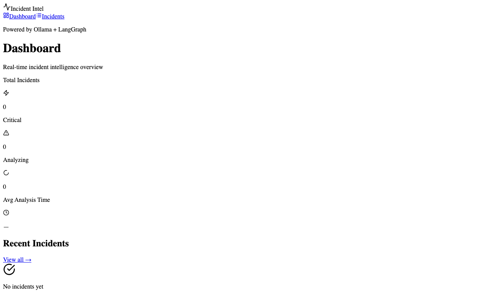

# Incident Intelligence



A multi-agent system for automated incident analysis and runbook generation. When an alert fires, a pipeline of specialized AI agents - log analyst, metrics correlator, root cause investigator, and runbook writer - work sequentially to triage the incident and produce actionable remediation steps.

The backend is FastAPI with SQLite. The frontend is a React/Vite dashboard. Everything runs via Docker Compose.

## Architecture

```
Alert / Webhook → API → Analysis Pipeline
                         ├── Log Analyst
                         ├── Metrics Correlator
                         ├── Root Cause Investigator
                         └── Runbook Writer
                              ↓
                         Incident stored in SQLite
                              ↓
                         React Dashboard
```

Each agent in the pipeline is an async Python function that receives shared state, calls Ollama for LLM inference, and appends its results before passing state to the next agent.

## Prerequisites

- Docker and Docker Compose
- [Ollama](https://ollama.com) running on the host with `llama3.2` pulled

```bash
ollama pull llama3.2
ollama serve
```

## Getting started

```bash
docker-compose up --build
```

- API: `http://localhost:8001`
- Frontend: `http://localhost:3001`
- API docs: `http://localhost:8001/docs`

## Creating an incident

```bash
curl -X POST http://localhost:8001/api/v1/incidents \
  -H "Content-Type: application/json" \
  -d '{
    "title": "High error rate on payment-service",
    "service_name": "payment-service",
    "severity": "critical",
    "log_snippets": [
      "ERROR 2024-01-15 timeout connecting to postgres",
      "ERROR 2024-01-15 connection pool exhausted"
    ],
    "metrics_data": {
      "error_rate": 0.34,
      "p99_latency_ms": 8200
    }
  }'
```

The incident is created immediately and analysis kicks off in the background. Poll the incident endpoint or watch the dashboard until `status` changes from `analyzing` to `analyzed`.

## Webhook integration

Point Grafana or Prometheus Alertmanager at `POST /api/v1/webhooks/grafana` or `POST /api/v1/webhooks/alertmanager` to have incidents created automatically from real alerts.

## API endpoints

| Method | Path | Description |
|--------|------|-------------|
| `POST` | `/api/v1/incidents` | Create an incident and trigger analysis |
| `GET` | `/api/v1/incidents` | List incidents (filter by severity, status, service) |
| `GET` | `/api/v1/incidents/{id}` | Get full incident detail including agent steps |
| `GET` | `/api/v1/incidents/{id}/runbook` | Get generated runbook as Markdown |
| `POST` | `/api/v1/incidents/{id}/analyze` | Re-trigger analysis on an existing incident |
| `GET` | `/api/v1/incidents/stats` | Aggregate stats and MTTR |
| `GET` | `/health` | Health check including Ollama status |

## Configuration

Edit environment variables in `docker-compose.yml`:

| Variable | Default | Description |
|----------|---------|-------------|
| `OLLAMA_BASE_URL` | `http://host.docker.internal:11434` | Ollama endpoint |
| `OLLAMA_MODEL` | `llama3.2` | Model to use for all agents |
| `DATABASE_URL` | SQLite at `/app/data/incidents.db` | Database connection |
| `LOG_LEVEL` | `INFO` | Logging level |
